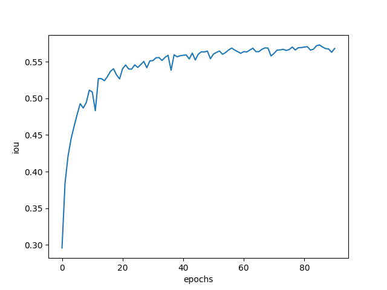
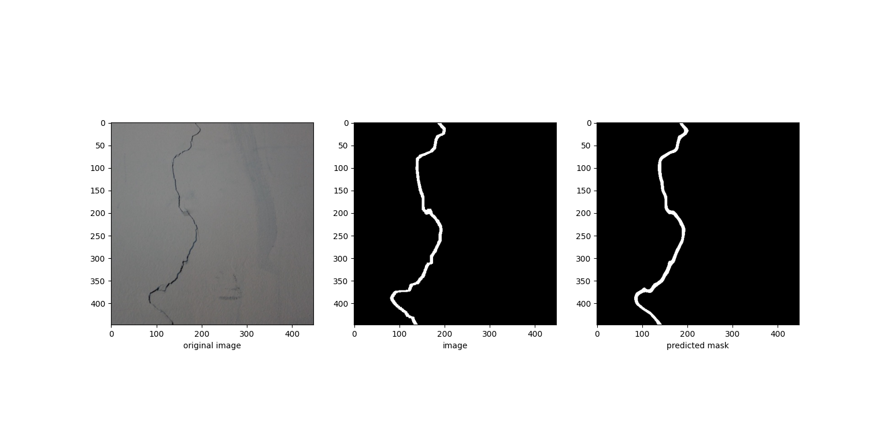
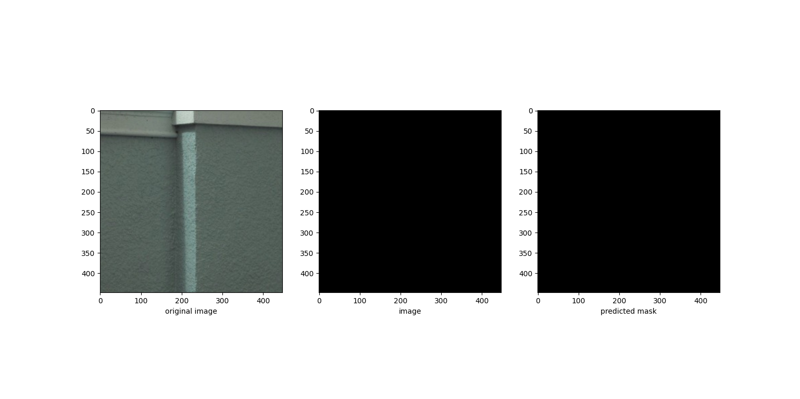
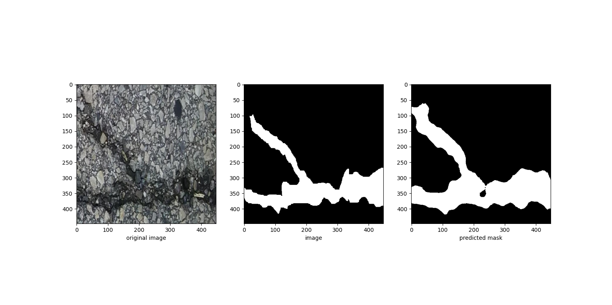
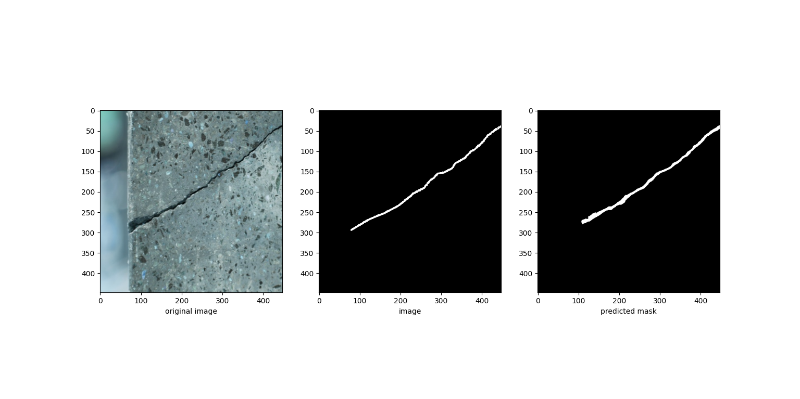

# Conglomerate concrete crack detection
## Crack detection as image segmentation

Conglomerate concrete crack detection as image segmentation task based on use of CNN models, Unet and SegNet, accuracy evaluated by iou metric which is intersection over union or Jaccard index. It was chosen because for  the segmentation tasks where its necessary to segment small objects, in our case cracks,  standard accuracy may not provide an accurate representation of model performance. This is because accuracy only considers the overall percentage of correctly classified pixels which gives pretty big accuracy already at start. IOU is defined as intersection of ground truth and predicted points over their union. Loss function is defined as 1-iou. The performance of models was evaluated with use of data that can be downloaded from https://drive.google.com/file/d/1RBY9o4uTvd_sVAfDs_igThZPZi0T3N9r/view?usp=sharing. Data consists of two parts-train and test. Each part consists of images of cracks and their masks. The number of elements in train part is 9899 samples. In test part there are 1096 samples. Overall 10995 elements. Each image has size of 448x488. The maximum iou score obtained by Unet model is 0.59, 

for SegNet it is 0.51.
Results for 4 random test samples:

